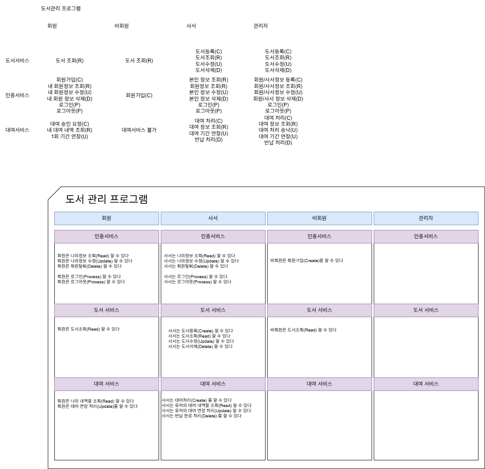
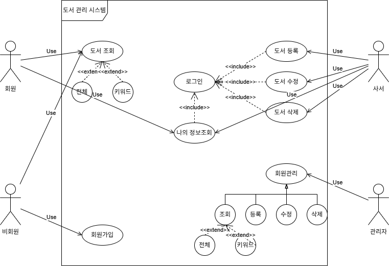

# 화면설계

---

## 1. UI/UX

### 1) UI(User Interface)

사용자가 사용법에 맞게 할 수 있는 환경

- 요구사항 확인  
  : PM이 고객의 요구사항을 정리

- 프로토타입  
  : 요구사항 정리사항 시각화

---

### 2) UI 설계

- 흐름 설계  
- 상세 설계

---

### 3) UX

- 사용자의 편의성과 같은 경험

---

### 4) 관련 기준

- ISO (국제표준화단체)  
- KRDS (한국 UI/UX 가이드라인)

---

## 2. 요구사항 확인

### 요구사항 정리 실습 (draw.io)

---

### 도서관리 프로그램 (오프라인)

#### 구성 요소

- 사서
- 회원
- 비회원
- 관리자

---

### 도서 서비스

| 구분 | 기능 |
|------|------|
| CREATE | 도서 등록 |
| READ | 도서 조회 |
| UPDATE | 도서 수정 |
| DELETE | 도서 삭제 |
| PROCESS | --- |

---

### 인증 서비스

| 구분 | 기능 |
|------|------|
| CREATE | 회원가입 |
| READ | 회원정보 조회 (단건, 전체) |
| UPDATE | 회원정보 수정 |
| DELETE | 회원정보 삭제 |
| PROCESS | 로그인, 로그아웃 |

---

### 대여 서비스

| 구분 | 기능 |
|------|------|
| CREATE | 대여처리 |
| READ | 대여 정보 조회 (단건, 전체) |
| UPDATE | 대여 정보 수정 |
| DELETE | 대여 반납 처리 |
| PROCESS | --- |

---

### 서비스 구조도

---

## 3. 유스케이스

요구사항이 끝난 후 유스케이스 작성

- 기능적 유스케이스 구현
- 비기능적 유스케이스 구현

---

### 관계 표현

- 액터와 유스케이스 연결 : 실선

- include  
  : 먼저 수행되어야 하는 관계  
  : <<include>>  
  : 점선

- extend  
  : 파생 기능  
  : <<extend>>  
  : 점선

- generalization  
  : 일반화  
  : {일반화 파편} -|> {기능}  
  : 실선 (빈 화살표)

*결제와 같이 외부 API를 사용하는 경우 내부에 액터를 생성하기도 함

---

### 유스케이스 다이어그램

---

### 유스케이스 명세서

구성 요소

- 목표
- 엑터
- 사전 조건
- 사후 처리
- 기본 흐름
- 대안 흐름
- 예외 흐름

---

## 4. 프로토타입

### Figma 툴 이용

---

### Wireframe

- 아이콘이나 사진 없이 기본 구조만 스케치
- 상호작용 없음
- PPT처럼 슬라이드 형식으로 확인

---

### 프로토타입

- 상호작용 존재
- 시각적으로 거의 완성된 형태

---

### 참고

폰트 : 프리텐다드

https://www.figma.com/design/doAt7Mv98ImaOusD5qumBt/01-Basic?node-id=3-190&t=UiV1hxstArygYBa8-0

